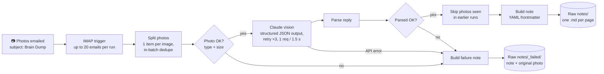

# Handwritten notes → Obsidian (n8n + Claude vision)

Take a photo of a handwritten page and email it to yourself with the subject **Brain Dump**. A few seconds later it's transcribed, titled and tagged, and it lands as its own note, with proper frontmatter, in your Obsidian vault.

It's a self-hosted [n8n](https://n8n.io) workflow. It runs on my laptop as a systemd service and has been in daily use since September 2026. **v2** (October 2026) handles batches unattended: send 20 photos at once and walk away. Anything that can't be transcribed is parked, photo included, in a `_failed/` folder instead of disappearing.



## What one run produces

One file per photo, for example `Raw notes/2026-10-05 2130 Weekly review- Code-Finance.md` ([full example](examples/example-entry.md)):

```markdown
---
title: "Weekly review: Code/Finance"
date: 2026-10-05
first_captured: 2026-10-05T21:30
tags:
  - weekly-review
  - habits
type: raw-note
status: inbox
source: "email: Brain Dump"
photo: "IMG_2041.jpg"
---

# Weekly review: Code/Finance

- Chess: visualization drills
- Atomic Habits: learning loop
```

Because the properties are real YAML, Dataview can query them straight away (`WHERE type = "raw-note" AND status = "inbox"`).

When something goes wrong, you get [a note like this](examples/example-failed.md) next to the original photo, explaining what failed and how to retry.

## Why email?

Email is the one inbox that every phone can already send to, with no app to install and no port to open. n8n holds an IMAP IDLE connection, so a new message triggers the workflow almost instantly, and the laptop doesn't need a public URL the way a webhook would.

## How it works

| # | Node | What it does |
|---|---|---|
| 1 | **Email Trigger (IMAP)** | Listens for `UNSEEN` mail with subject `Brain Dump`. It fetches up to 20 emails per execution, with every attachment as binary (`attachment_0…n`) |
| 2 | **Split photos** | One item per image across all emails. Infers the MIME type, skips non-images, drops a photo repeated within the batch (FNV-1a content hash), and flags unsupported types (HEIC) or photos over the API's 5 MB base64 limit |
| 3 | **Photo OK?** | Sends problems to the failure branch before any API spend |
| 4 | **Claude (vision)** | `POST /v1/messages` with **structured outputs** (`output_config.format` → JSON schema `{title, date, tags, body_markdown}`). Retries 3× with 5 s between tries, sends 1 request every 1.5 s, and routes errors to a separate output instead of failing the run. The API key lives in an n8n **Header Auth** credential |
| 5 | **Parse reply** | Per item. Takes the text block, checks `stop_reason` (`max_tokens`, `refusal`) and parses it |
| 6 | **Skip duplicate photos** | n8n's *Remove Duplicates* with history across executions, so the same photo sent again tomorrow isn't written twice |
| 7 | **Build note** | YAML frontmatter (JSON-quoted strings are valid YAML), Obsidian-safe tags, a filename-safe title, and a body with any duplicated title heading removed |
| 8 | **Write note** | `Raw notes/YYYY-MM-DD HHmm <title>.md` |
| 9 | **Build failure note → Write to _failed** | Explains the error and links the email, and saves the original photo next to the note |
| – | **Error handler** (separate workflow) | Set as the workflow's *Error Workflow*. Catches anything unexpected and writes a note with the execution link |

## Stack

- **n8n 2.8.4**, self-hosted, SQLite, run as a systemd user service ([`deploy/n8n.service`](deploy/n8n.service))
- **Claude Messages API** (vision + structured outputs), called through the generic HTTP Request node
- **IMAP**: any mailbox; I use Gmail with an app password
- **Obsidian**: the vault is a plain folder, synced to other devices by the OneDrive Linux client

**Measured cost:** a full-resolution phone photo is about 5,200 input and 180 output tokens, about **$0.012 per page** on Claude Sonnet 5 ($2 / $10 per million tokens).

## Setup

1. **Install n8n** (`npm i -g n8n`) and open `http://localhost:5678`.
2. **Import both workflows** from `workflow/`: [`error-handler.json`](workflow/error-handler.json) first, then [`brain-dump-to-obsidian.json`](workflow/brain-dump-to-obsidian.json).
3. **Credentials.** Create them, then attach them to the nodes that show a warning:
   - *IMAP*: host, port 993, SSL, user, and an **app password**.
   - *Header Auth*: name `x-api-key`, value = your Anthropic API key.
4. **Paths and timezone.** Set `RAW_DIR` and `TZ` at the top of **Build note**, **Build failure note** and the error handler's code node. Then create the folders:
   ```bash
   mkdir -p "/path/to/your/Obsidian Vault/Raw notes/_failed"
   ```
5. **Link the error handler.** In the main workflow, go to *Settings → Error Workflow →* `Email-Obsidian error handler`.
6. **Allow file access.** n8n 2.x sandboxes file nodes to `~/.n8n-files`. Add your vault with `N8N_RESTRICT_FILE_ACCESS_TO="/path/to/vault;$HOME/.n8n-files"`. The [systemd unit](deploy/n8n.service) does this:
   ```bash
   cp deploy/n8n.service ~/.config/systemd/user/   # edit the vault path first
   systemctl --user daemon-reload && systemctl --user enable --now n8n
   loginctl enable-linger "$USER"                   # optional: keep running after logout
   ```
7. **Publish.** In n8n 2.x, saving only updates the draft. Click **Publish** (or run `n8n publish:workflow --id=<id>`), and look for `Activated workflow` in `journalctl --user -u n8n`.
8. **Test.** Email yourself 2–3 photos, attached as files (not pasted inline).

## Testing without a mailbox

Before deploying v2, I ran it with a test harness: a Manual Trigger that reads files from disk and shapes them like IMAP output (4 emails: a normal photo, a PNG plus a 9 MB photo, an email with only a `.txt`, and an exact repeat). It ran through `n8n execute --id` against a backed-up database, with output going to a scratch folder. Results:

| Case | Expected | Got |
|---|---|---|
| Normal JPEG | Note written | ✅ |
| PNG in the same email as a 9 MB photo | PNG → note; big photo → `_failed/` with the photo | ✅ |
| Email with no image | `_failed/` note, no API call | ✅ |
| Same photo twice in one batch | Second copy dropped before the API call | ✅ (after fix 9 below) |
| Same photos in the next run | Dropped by the cross-execution dedupe | ✅ |

## Where it failed

Every one of these happened while I was building it. The fix for each one is in the workflow or the service file.

| # | Symptom | Real cause | Fix |
|---|---|---|---|
| 1 | `401` from the API | The key was hard-coded in the node's headers and had expired; it was also leaking into execution logs | Encrypted **Header Auth** credential; rotated the key |
| 2 | `The file "/…/Documents/.md" is not writable`, which looked like a OneDrive permission problem | The **Set** node drops fields it didn't create by default, so `{{ $json.title }}` was `undefined` | Turned on *Include Other Fields* (v1); in v2 a Code node builds the path |
| 3 | `EBADF: bad file descriptor` | The write node's *Append* option opens the file with `O_APPEND` only | v1: read → merge → overwrite. v2: one file per note, so nothing is appended |
| 4 | `Access to the file is not allowed` | n8n 2.x restricts file nodes (`N8N_RESTRICT_FILE_ACCESS_TO`) | Allow-list in the systemd unit |
| 5 | The fix was lost on restart | n8n had been started with `nohup` | systemd user service, `Restart=on-failure` |
| 6 | A test ran an older version | n8n 2.x separates the draft from the published version | Publish after every change |
| 7 | **Batch: 10 emails in, 1 note out** (found in a code review) | `$input.item` in a Code node's default *Run once for all items* mode is **always item 0** | v2: per-item mode, plus a split node that loops over every email and attachment |
| 8 | `invalid syntax` on every API call in v2 testing | The JSON schema inside the `{{ … }}` expression contained `}}`, which ends an n8n expression early | Space out nested closing braces (`} }`) |
| 9 | The same photo twice in one batch produced 2 notes | *Remove Duplicates → previous executions* only compares against **earlier runs** | Also dedupe inside the batch, in the split node, before paying for the API call |

## Known limitations

- **Photos pasted inline into the email body are ignored.** n8n's IMAP node only collects parts marked as attachments.
- **No resizing.** Photos over about 3.7 MB go to `_failed/`. n8n's Edit Image node needs GraphicsMagick, which isn't installed here.
- **The email is marked as read before processing.** That's why every failure path saves the photo to `_failed/`. A crash inside the error handler itself would still lose it.
- **Cross-run dedupe is by exact bytes.** Re-sending a photo whose note you deleted is skipped. The same page photographed twice is *not* caught.
- **Laptop-bound.** It runs while the machine is on. Mail waits in the inbox until then.

## Repo layout

```
workflow/brain-dump-to-obsidian.json      v2 main workflow (import this)
workflow/error-handler.json               Error Trigger → note in _failed/
workflow/legacy/v1-append-to-single-note.json   v1: appended everything into one note
deploy/n8n.service                        systemd user unit with the file-access allow-list
examples/                                 sample output and failure notes
```

## Roadmap

- [ ] Telegram bot capture with a "✅ saved: <title>" reply
- [ ] Auto-resize large photos
- [ ] Message Batches API mode for importing a backlog of old photos at 50% off
- [ ] Classify each note (type, domain, action items) at capture time

## License

MIT
