# Handwritten notes → Obsidian (n8n + Claude vision)

Take a photo of a handwritten page, email it to yourself with the subject **Brain Dump**, and a few seconds later it's transcribed, titled, tagged and appended to a note in your Obsidian vault.

It's a self-hosted [n8n](https://n8n.io) workflow. It runs on my laptop as a systemd service and has been in daily use since September 2026.

```mermaid
flowchart LR
    A[📷 Phone photo<br/>emailed, subject Brain Dump] --> B[IMAP trigger<br/>UNSEEN + subject filter]
    B --> C[Code<br/>attachment → base64]
    C --> D[HTTP Request<br/>Claude Messages API, vision]
    D --> E[Code<br/>strip fences, JSON.parse]
    E --> F[Set<br/>build markdown entry]
    F --> G[Read file<br/>Raw notes.md]
    G --> H[Code<br/>existing + new entry]
    H --> I[Write file<br/>overwrite Raw notes.md]
    I --> J[(Obsidian vault<br/>synced by OneDrive)]
```



## Why email?

Email is the one inbox that every phone can already send to, with no app to install and no port to open. n8n holds an IMAP connection open (IMAP IDLE), so a new message triggers the workflow almost instantly, and the laptop doesn't need a public URL the way a webhook would.

## What one run produces

Input: a photo of a page in my notebook. Output appended to `Notes Compressor/Raw notes.md` (example in [`examples/example-entry.md`](examples/example-entry.md)):

```markdown
--- date: 2026-09-17 tags: [productivity, deep work, ideas] ---  # Highest leverage  ## Highest leverage

i) CLI
ii) 5 (Big) deep work periods
   - complete first 20 hrs
...
```

## How it works

| # | Node | Type | What it does |
|---|---|---|---|
| 1 | Email Trigger (IMAP) | `emailReadImap` v2.1 | Listens for `UNSEEN` mail with subject `Brain Dump`, downloads attachments as binary (`attachment_0`, `attachment_1`, …) |
| 2 | Code in JavaScript | `code` | Reads `attachment_0` from n8n's binary store and base64-encodes it |
| 3 | HTTP Request | `httpRequest` v4.4 | `POST https://api.anthropic.com/v1/messages` with the image and a system prompt asking for JSON `{title, date, tags, body_markdown}`. The API key comes from an n8n **Header Auth** credential, never from the node |
| 4 | Code in JavaScript1 | `code` | Strips accidental ```` ```json ```` fences and parses the JSON |
| 5 | Edit Fields | `set` v3.4 | Builds `obsidian_final`, the markdown entry (with **Include Other Fields** on) |
| 6 | Read Raw Notes | `readWriteFile` | Reads the current note into binary property `existing` |
| 7 | Code in JavaScript2 | `code` | Concatenates existing text + blank line + new entry, re-encodes it |
| 8 | Read/Write Files from Disk1 | `readWriteFile` | Overwrites the note with the combined text |

Steps 6–8 are a manual append. n8n's built-in "Append" checkbox throws `EBADF` on my setup (see below).

## Stack

- **n8n 2.8.4**, self-hosted, SQLite, run as a systemd user service ([`deploy/n8n.service`](deploy/n8n.service))
- **Claude Messages API** (vision), called through the generic HTTP Request node
- **IMAP**: any mailbox; I use Gmail with an app password
- **Obsidian**: the vault is a plain folder, synced to other devices by the OneDrive Linux client

## Setup

1. **Install n8n** (`npm i -g n8n`) and start it once, then open `http://localhost:5678`.
2. **Import the workflow.** Go to *Workflows → Import from file → [`workflow/brain-dump-to-obsidian.json`](workflow/brain-dump-to-obsidian.json)*, or run:
   ```bash
   n8n import:workflow --input=workflow/brain-dump-to-obsidian.json
   ```
3. **Create two credentials** and attach them to the nodes that show a warning:
   - *IMAP*: host, port 993, SSL, user, and an **app password** (Gmail won't accept your normal password).
   - *Header Auth*: name `x-api-key`, value = your Anthropic API key.
4. **Point it at your vault.** Replace `/path/to/your/Obsidian Vault/...` in **Read Raw Notes** and **Read/Write Files from Disk1**. The target note must already exist.
5. **Allow n8n to touch that folder.** n8n 2.x sandboxes file nodes to `~/.n8n-files`. Add your vault:
   ```bash
   N8N_RESTRICT_FILE_ACCESS_TO="/path/to/your/Obsidian Vault;$HOME/.n8n-files"
   ```
   The systemd unit in [`deploy/`](deploy/n8n.service) sets this for you:
   ```bash
   cp deploy/n8n.service ~/.config/systemd/user/   # edit the vault path first
   systemctl --user daemon-reload && systemctl --user enable --now n8n
   loginctl enable-linger "$USER"                   # optional: keep running after logout
   ```
6. **Publish.** In n8n 2.x, saving only updates the draft. Click **Publish** so the trigger starts listening, then check `journalctl --user -u n8n` for `Currently active workflows: …`.
7. **Test.** Email yourself a photo with the subject `Brain Dump`.

## Where it failed

Every one of these happened while I was building it. The fix for each one is in the workflow or in the service file.

| Symptom | Real cause | Fix |
|---|---|---|
| `401` from the API | The key was hard-coded in the node's headers and had expired; it was also leaking into every execution log | Moved it to an encrypted **Header Auth** credential and rotated the key |
| `The file "/…/Documents/.md" is not writable`, which looked like a OneDrive permission problem | The **Set** node drops every field it didn't create by default, so `{{ $json.title }}` was `undefined` and the filename became `.md` | Turned on **Include Other Fields**; the write path is now fixed instead of built from the title |
| `EBADF: bad file descriptor` | The write node's **Append** option opens the file with `O_APPEND` only (no `O_WRONLY`/`O_CREAT`) | Read → merge in a Code node → overwrite |
| `Access to the file is not allowed. Allowed paths: ~/.n8n-files` | n8n 2.x restricts file nodes by default (`N8N_RESTRICT_FILE_ACCESS_TO`) | Added the vault to the allow-list in the systemd unit |
| The fix was lost on restart | n8n had been started with `nohup` | Moved it to a systemd user service with `Restart=on-failure` |
| One test ran an older version of the workflow | The live trigger kept the previously activated version until it was published again | Publish after every change. In n8n 2.x the draft and the live version are separate |
| Every failed test burned an email | The IMAP trigger marks mail as read when it's fetched, before the rest of the workflow runs | Send a fresh unread email per test |

## Known limitations

I'm documenting these rather than hiding them. They're the v2 roadmap.

- **Batches: only the first email gets saved.** The IMAP trigger emits up to 20 new emails as items in one execution. Nodes 4 and 7 use `$input.item` in the Code node's default *Run once for all items* mode, and in that mode `$input.item` is always item 0. The fix is to switch both nodes to *Run once for each item*, or loop over `$input.all()`.
- **Only the first photo per email.** Only `attachment_0` is read.
- **JPEG is assumed.** `media_type` is hard-coded to `image/jpeg`, so PNG and HEIC fail. Very large photos can exceed the API's per-image size limit; resize first.
- **The frontmatter is on one line.** The Set node's template has no newlines, so Obsidian treats `--- date … ---` as text rather than properties.
- **No dedupe and no failure alert.** Sending the same photo twice appends it twice, and a failed run is only visible in n8n's execution list.
- **Read-modify-write on a synced file.** If the sync client rewrites the note between the read and the write, one side's change is lost.

## Roadmap

- [ ] Code nodes per item + a loop over every `attachment_*`
- [ ] Structured outputs (`output_config.format` with a JSON schema) instead of fence-stripping
- [ ] Real YAML frontmatter, and one file per note in an `Inbox/` folder so concurrent writes can't collide
- [ ] An error workflow that emails or pings me when a run fails, plus dedupe on `Message-ID`
- [ ] A queue-and-retry setup so a backlog of hundreds of photos runs unattended

## License

MIT
